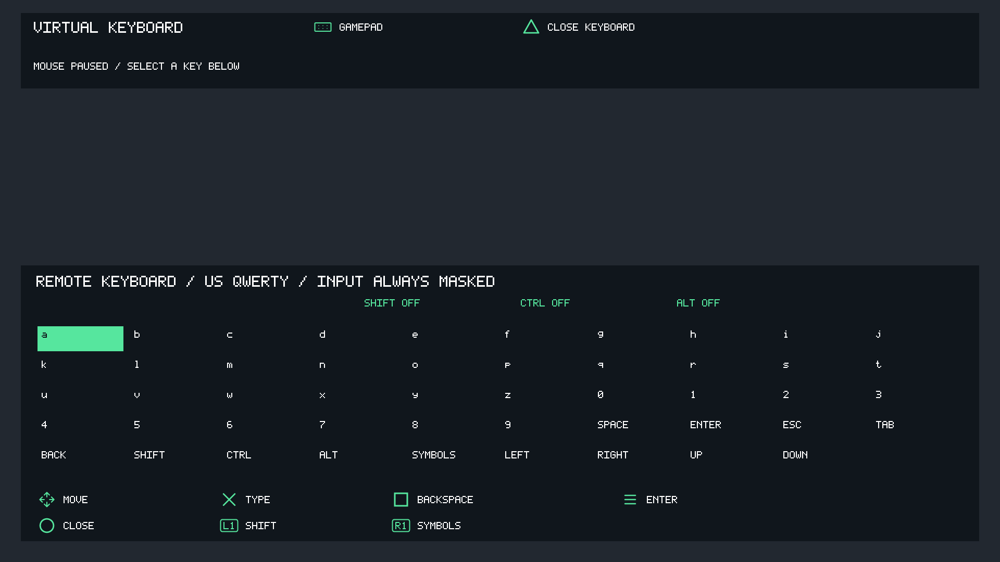
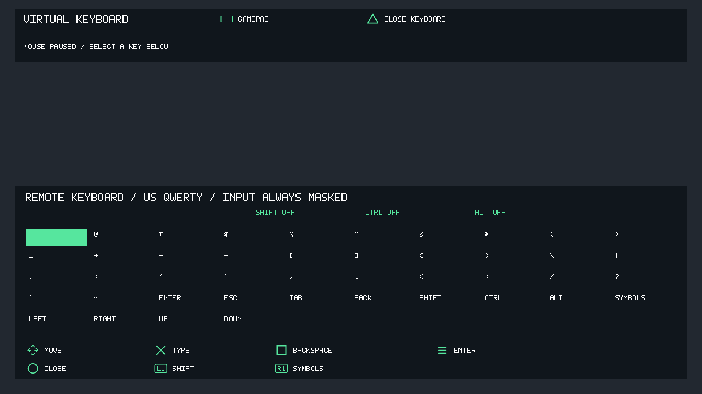

# OpenNOW PS5 0.0.6

This prerelease adds a DualSense virtual mouse and remote keyboard for game
launchers, login screens and menus that require keyboard/mouse input.
Tag `0.0.6` maps to native content version `00.002.036`, title ID `PPSA99082`.

## Changes

- Press the touchpad alone during streaming to toggle virtual mouse mode.
  Options + touchpad still stops the stream.
- Move the pointer with the right stick; hold R2/L2 for left/right clicks and
  dragging. Scroll vertically/horizontally with the D-pad. Square cycles three
  pointer speeds.
- Triangle opens the remote keyboard. It supports lowercase/uppercase letters,
  digits, printable ASCII symbols, Enter, Escape, Tab, Backspace, arrow keys,
  Shift, Ctrl and Alt on the session's US QWERTY layout.
- Reuse PS5 control icons for the on-screen shortcuts, with matching touchpad,
  right-stick and trigger symbols.
- Send native NVIDIA keyboard and mouse packets over the reliable input channel,
  including protocol-version envelopes, paired presses/releases and modifier
  chords. Request the server-rendered pointer rather than estimating its position.
- Suppress gamepad input while virtual mode is active. Cancel pending strokes and
  release held keys/buttons on mode changes, controller disconnection and stop;
  retry failed releases while the input channel remains available.
- Mask local typing feedback without keeping or logging a plaintext input string.
  Remote launcher fields control their own password masking.
- Draw controls over software video and native GPU video, with a bounded-luminance
  HDR overlay.

## Validation and limitations

Host streaming/protocol regressions passed with ASan/UBSan, including fixed
keyboard/mouse wire fixtures, modifier chords, cancelled input and failed-release
retries. Both keyboard pages were visually checked with synthetic previews.
The native GPU package was built on the Linux VPS and its import audit passed;
the overlay shaders passed GLSL validation.

The feature build was installed on the console with all 32 activated files
SHA-256 verified in confirmed raw SELF transfer mode and the previous complete
title tree retained for rollback. The release increments content metadata to
`00.002.036`. Launcher input, remote cursor capture and HDR overlay appearance
still require user acceptance on console. No new FPS or HDR playback results are
claimed. USB keyboard/mouse support and a full keyboard/mouse gameplay mapping
are not included.

## Installation

Download `OpenNOW-PS5-0.0.6.zip`, its manifest and `SHA256SUMS`. Verify checksums,
close OpenNOW and retain a rollback copy before replacing the complete
`PPSA99082` folder through a compatible native homebrew directory loader.
Preserve `/data/opennow`, which contains private login and launch-age data.
This is a directory package, not a retail PKG.

The source archive includes tracked sources, pinned upstream revisions and
licenses. Release assets exclude personal configuration, private console repair
tools, diagnostics, captures, dumps and proprietary SDK binaries.
