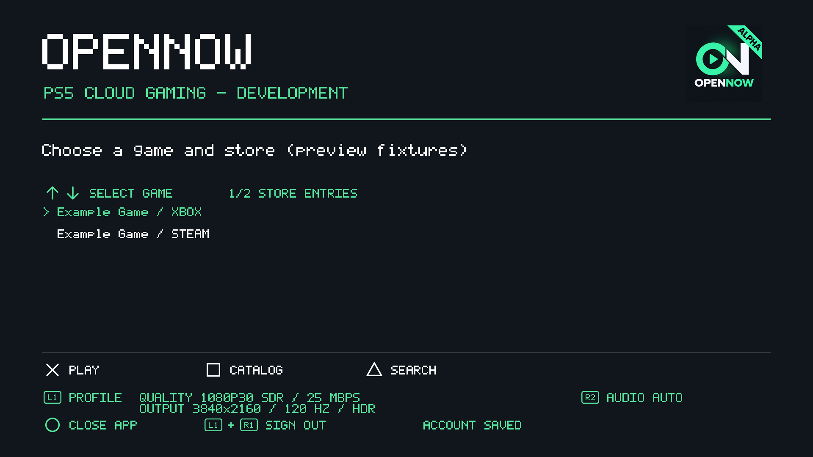

# OpenNOW PS5 0.0.7

This prerelease adds audio format selection, multichannel Opus decoding and
adaptive audio buffering. Tag `0.0.7` maps to native content version
`00.002.037`, title ID `PPSA99082`.

## Changes

- Press R2 in the catalog to select Auto, Stereo, 5.1 or 7.1 before launching.
- Request the selected audio format through CloudMatch; choose the widest valid
  WebRTC Opus layout actually offered by GFN, with stereo fallback.
- Decode explicit multiopus stream/channel mappings and route family-1 speaker
  order to the PS5 eight-channel PCM output. Follow negotiated RTP/RED payload IDs.
- Keep 48 kHz audio and request bitrate ceilings of 256 kb/s stereo, 384 kb/s 5.1
  and 510 kb/s 7.1. The server determines the actual bitrate.
- Adapt the jitter reserve from 20 to 40 ms after starvation, account for packet
  duration at startup, bound queue excess and preserve the newest samples.
- Retain RED recovery, add in-band FEC attempts with PLC fallback, and restart the
  audio epoch on large or invalid timestamp gaps.
- Recover from seats that initially send valid stereo despite describing surround.
- Report negotiated/requested channels, primary codec bitrate, queue depth,
  dropped frames, output errors and recovery counters in private diagnostics.
- Remove the fixed stereo label from video output information.

## Validation and limitations

Host regressions passed with ASan/UBSan, including allocation, malformed offer
fallback, channel placement, dynamic RED payloads, queue overflow and re-priming,
and sustained 20 ms packets with 256-frame output grains. The synthetic catalog
preview was visually checked. The native GPU package built on the Linux VPS and
passed its import audit.

The feature build was installed on the console as `00.002.036`, with all 32
activated files SHA-256 verified in confirmed raw SELF mode and the complete
previous title tree retained. This release uses `00.002.037` to distinguish it
from 0.0.6. Live audio acceptance, 5.1/7.1 negotiation and speaker placement are
still pending; installation/hash verification is not playback validation.

Auto verifies AudioOut port capability, not physical speakers or HDMI receiver
capabilities. Some GFN seats may offer only stereo on this WebRTC transport.
This release does not add the separate native RTSP/NVST transport, a full
A/V synchronization clock, lossless audio or Atmos. Prior FPS/HDR observations
are unchanged. Virtual keyboard/mouse controls introduced in 0.0.6 remain included.

## Installation

Download `OpenNOW-PS5-0.0.7.zip`, its manifest and `SHA256SUMS`. Verify checksums,
close OpenNOW and retain a rollback copy before replacing the complete
`PPSA99082` folder through a compatible native homebrew directory loader.
Preserve `/data/opennow`, which contains private login and launch-age data.
This is a directory package, not a retail PKG.

The source archive includes tracked sources, pinned upstream revisions and
licenses. Release assets exclude personal configuration, private console repair
tools, diagnostics, captures, dumps and proprietary SDK binaries.
